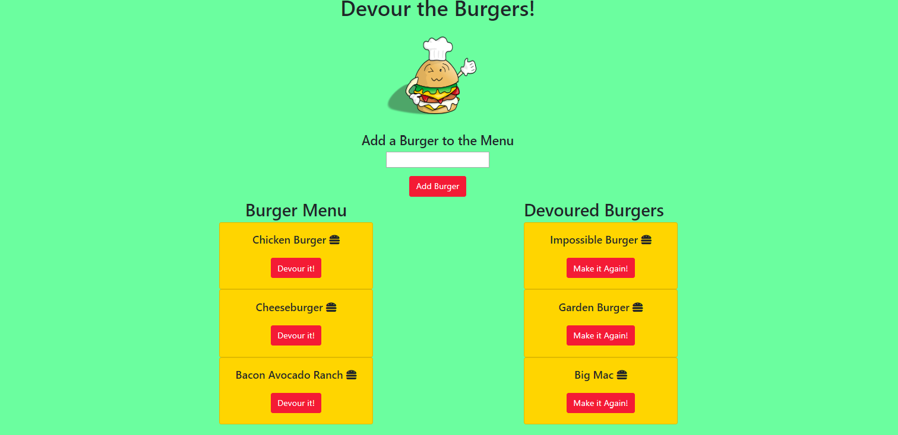

# Devour the Burgers

## Table of Contents
* [General Info](#general-info)
* [Technologies](#technologies)
* [Screenshot](#screenshot)
* [Credits](#credits)
* [License](#license)

## General Info
Devour the Burgers is a a restaurant app that lets users input the names of burgers they'd like to eat. Whenever a user submits a burger's name, the app will display the burger on the left side of the page -- waiting to be devoured. Each burger in the waiting area also has a Devour it! button. When the user clicks it, the burger will move to the right side of the page to the Devoured Burgers List. The user has the option to change a devoured burger back to a burger that is ready to eat with the Make it Again! button. The app app stores every burger in a database, whether devoured or not. 
First the user must use the following command to install dependencies required:
```sh
npm install
```
The application is then invoked with the following commands:
```sh
node server.js
```

## Technologies
This project is created with:
* Bootstrap 
* Express.js
* Handlebars.js
* Node.js 
* HTML
* JavaScript
* jQuery
* mySQL
* mySQL Workbench

## Screenshot 



# Credits
I consulted my course GitLab repository, Stack Overflow (www.stackoverflow.com), W3Schools (https://www.w3schools.com/js/js_array_methods.asp), Handlebars JS (https://handlebarsjs.com/) and MySQL Tutorial (https://www.mysqltutorial.org/mysql-nodejs/update/) in creating my project. 

## License
MIT License

Copyright (c) [2020] [Rachel Rohrbach]

Permission is hereby granted, free of charge, to any person obtaining a copy
of this software and associated documentation files (the "Software"), to deal
in the Software without restriction, including without limitation the rights
to use, copy, modify, merge, publish, distribute, sublicense, and/or sell
copies of the Software, and to permit persons to whom the Software is
furnished to do so, subject to the following conditions:

The above copyright notice and this permission notice shall be included in all
copies or substantial portions of the Software.